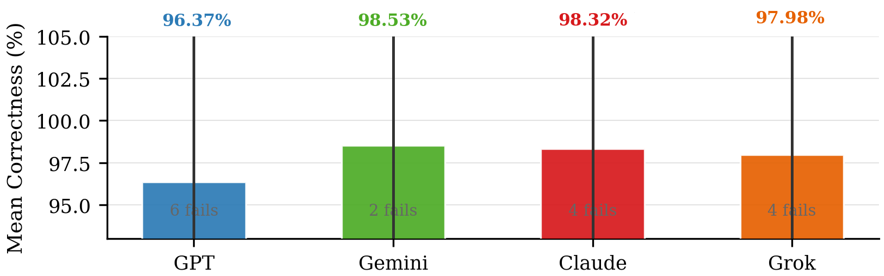
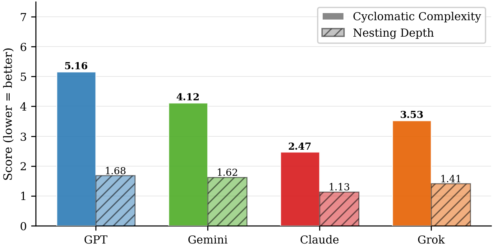
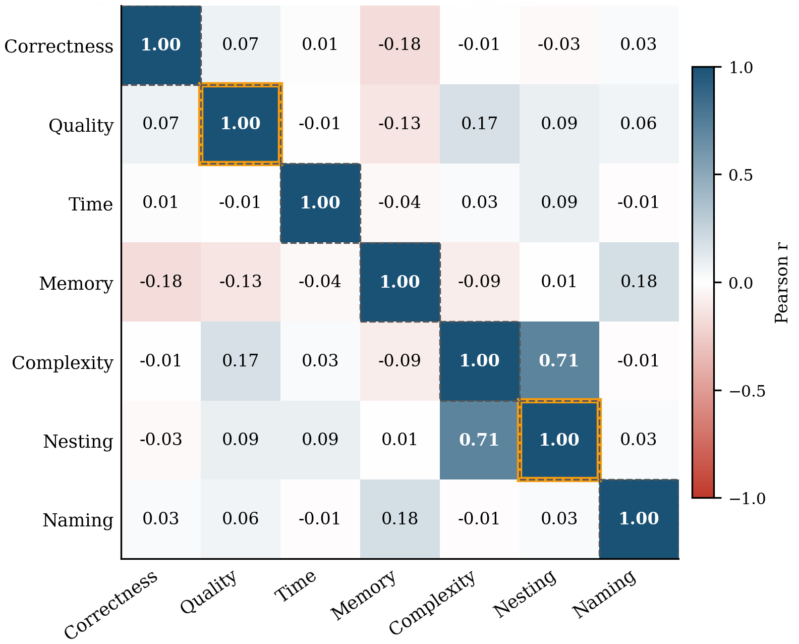
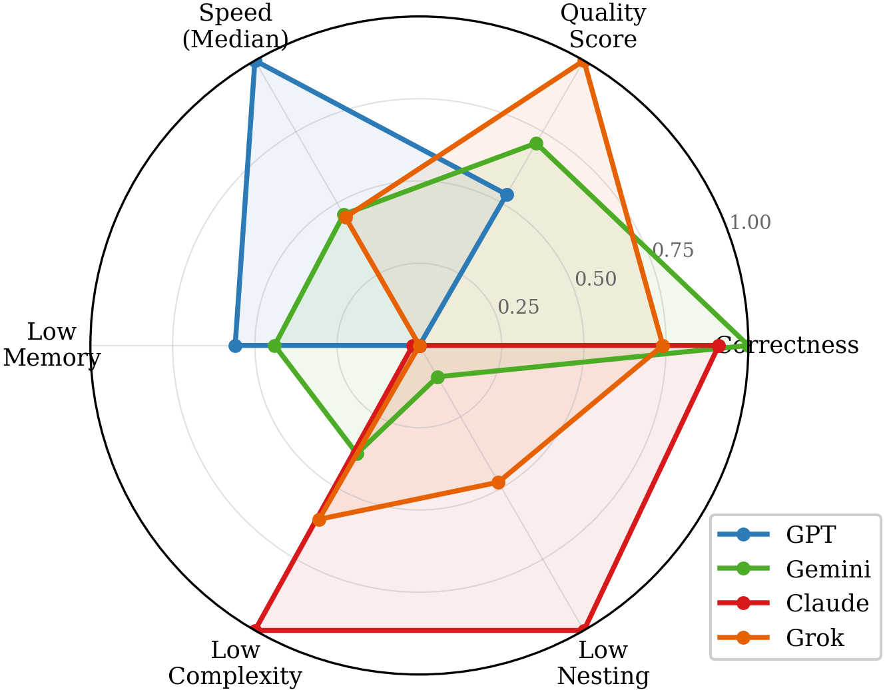
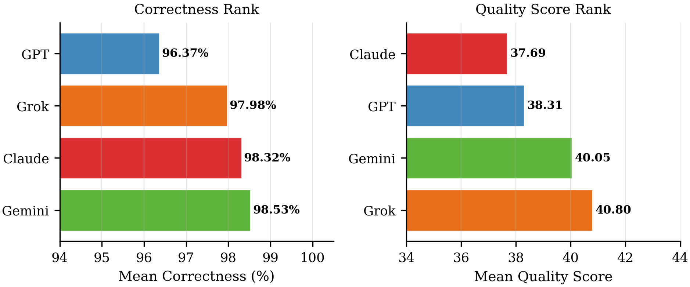
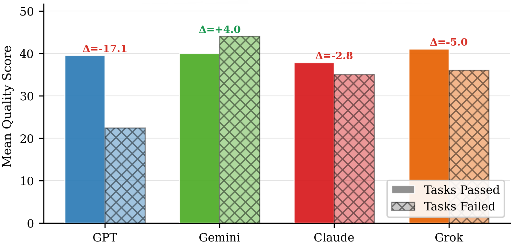

# 🏆 Benchmarking the Titans
## A Multi-Dimensional Empirical Evaluation of LLM Code Generation Quality in the .NET Ecosystem

<p align="center">
  <a href="https://conf.researchr.org/home/staf-2026/llm4se-2026"></a>
  <a href="https://github.com/mohammadmehdighalandarian/llm4se/blob/main/LICENSE"></a>
  
  
  
</p>

<p align="center">
  <b>Seyed Mohammad Mahdi Ghalandarian &nbsp;·&nbsp; Majid Bazargani &nbsp;·&nbsp; Masoumeh Taromirad</b><br>
  Department of Computer Engineering, Amirkabir University of Technology, Tehran, Iran
</p>

---

## 📌 Overview

Current LLM benchmarks reduce everything to a single **Pass@k** metric — but does passing tests mean the code is actually good? This paper says **no**.

We build a fully automated C# evaluation framework and apply it to **GPT-4, Gemini 1.5 Pro, Claude 3.5 Sonnet, and Grok 3**, measuring each solution across three independent dimensions:

| Dimension | Tool | Research Question |
|---|---|---|
| ✅ Functional Correctness | .NET Reflection + unit tests | RQ1 |
| 🔍 Static Code Quality | Microsoft Roslyn AST analysis | RQ2 |
| ⚡ Runtime Efficiency | BenchmarkDotNet profiling | RQ4 |

> **Central Finding:** Correctness and code quality are empirically **orthogonal** (Pearson r = 0.075) — a model ranking first on Pass@k may simultaneously rank last on structural quality.

---

## 🔬 Key Results

### Model Comparison Summary

| Model | Correctness (%) | Quality Score | Complexity | Nesting | Time (ns) | Memory (MB) | Failures |
|---|---|---|---|---|---|---|---|
| **GPT-4** | 96.37 | 38.31 | 5.16 | 1.68 | 4,823 | 11.7 | 6 |
| **Gemini 1.5 Pro** | **98.53** | 40.05 | 4.12 | 1.62 | 9,034 | 28.9 | **2** |
| **Claude 3.5 Sonnet** | 98.32 | 37.69 | **2.47** | **1.13** | 12,859 | 156.6 | 4 |
| **Grok 3** | 97.98 | **40.80** | 3.53 | 1.41 | 9,136 | **6.0** | 4 |

### 🏅 Each Model Leads in One Dimension
- 🥇 **Gemini** — highest correctness (98.53%)
- 🥇 **Grok** — highest quality score (40.80) and least memory (6.0 MB)
- 🥇 **Claude** — simplest code structure (complexity 2.47, nesting 1.13)
- 🥇 **GPT** — fastest execution (4,823 ns median)

---

## 📊 Figures

<table>
  <tr>
    <td align="center"><br><sub>Mean Correctness with ±1 SD error bars</sub></td>
    <td align="center"><br><sub>Cyclomatic Complexity and Nesting Depth</sub></td>
  </tr>
  <tr>
    <td align="center"><br><sub>Pearson Correlation Matrix (n=340)</sub></td>
    <td align="center"><br><sub>Multi-Dimensional Radar Profile</sub></td>
  </tr>
  <tr>
    <td align="center"><br><sub>Ranking Reversal: Correctness vs Quality</sub></td>
    <td align="center"><br><sub>GPT's Bimodal Failure Behavior</sub></td>
  </tr>
</table>

---

## 🏗️ Framework Architecture

The evaluation pipeline operates in four phases:

```
HumanEval JSON
      │
      ▼
┌─────────────────┐    ┌──────────────────┐    ┌──────────────────┐    ┌──────────────────┐
│    PHASE 1      │    │     PHASE 2      │    │     PHASE 3      │    │     PHASE 4      │
│ Data Preparation│───►│ Code Generation  │───►│   Evaluation     │───►│Result Collection │
│                 │    │                  │    │                  │    │                  │
│ HumanEval→Excel │    │ 4 LLMs, T=0      │    │ Pass 1: Correct. │    │ 340 rows         │
│ solution_prompt │    │ .NET 8.0 project │    │ Pass 2: Quality  │    │ Composite Score  │
│ benchmark_prompt│    │ per task         │    │ Pass 3: Runtime  │    │ Pearson r=0.075  │
└─────────────────┘    └──────────────────┘    └──────────────────┘    └──────────────────┘
     85 tasks               340 solutions            RQ1·RQ2·RQ4             RQ3 analysis
```

---

## 📂 Repository Structure

```
llm4se/
├── 📄 paper.pdf                  # Published paper (LLM4SE 2026)
├── 📊 data/
│   └── Resualt.xlsx              # Full results dataset (340 solutions × 9 metrics)
├── 🖼️ figures/                   # All paper figures (PNG)
│   ├── fig1_highlevel.png
│   ├── fig2_dataset.png
│   ├── fig3_generation.png
│   ├── fig_correctness.png
│   ├── fig_complexity.png
│   ├── fig_performance.png
│   ├── fig_correlation.png
│   ├── fig_ranking.png
│   ├── fig_bimodal.png
│   └── fig_radar.png
└── 📖 README.md
```

---

## 🧪 Experimental Setup

| Configuration | Detail |
|---|---|
| **Hardware** | AMD Ryzen 9 5900X, 16 GB RAM, Windows 11 |
| **Runtime** | .NET 8.0 SDK |
| **Benchmark** | HumanEval (85 of 164 tasks adapted to C#) |
| **API Temperature** | 0 (deterministic decoding, Pass@1 setting) |
| **Profiling** | BenchmarkDotNet, N = 100 / 1,000 / 10,000 iterations |
| **Harness Generator** | DeepSeek-V3 (independent, prevents evaluation bias) |
| **Total Solutions** | 340 (85 tasks × 4 models) |

---

## 📐 Composite Quality Score

Each solution receives a score from 0 to 100 aggregating five normalized components:

$$\text{Score} = \frac{\text{Norm\\_C} + \text{Norm\\_Cx} + \text{Norm\\_N} + \text{Norm\\_S} + \text{Norm\\_P}}{5} \times 100$$

| Component | Description | Direction |
|---|---|---|
| **Norm_C** | Correctness (% assertions passed) | ↑ higher = better |
| **Norm_Cx** | Cyclomatic Complexity | ↓ lower = better (inverted) |
| **Norm_N** | Nesting Depth | ↓ lower = better (inverted) |
| **Norm_S** | Naming Style (PascalCase / camelCase) | ↑ higher = better |
| **Norm_P** | Professionalism (XML docs + null-checks) | ↑ higher = better |

---

## 🔍 Research Questions & Answers

**RQ1 (Correctness):** Gemini leads (98.53%, 2 failures). GPT has the highest variance (SD = 15.37), exhibiting a bimodal pattern of fully correct or substantially failed solutions.

**RQ2 (Task Complexity):** Cross-model complexity correlations (r = 0.63–0.69) confirm that task difficulty, not model choice, is the primary driver of structural complexity. Benchmarks must control for task difficulty.

**RQ3 (Orthogonality):** Correctness and quality are empirically orthogonal (r = 0.075, n = 340). Pass@k rankings are statistically uninformative about code quality.

**RQ4 (Performance):** GPT is fastest (4,823 ns); Grok uses least memory (6.0 MB). All models remain within one order of magnitude on median execution time.

---

## 📜 Citation

If you use this work, please cite:

```bibtex
@inproceedings{ghalandarian2026benchmarking,
  author    = {Ghalandarian, Seyed Mohammad Mahdi and Bazargani, Majid
               and Taromirad, Masoumeh},
  title     = {Benchmarking the Titans: A Multi-Dimensional Empirical
               Evaluation of {LLM} Code Generation Quality in the
               .{NET} Ecosystem},
  booktitle = {Proc. 2nd Workshop on Large Language Models For
               Generative Software Engineering (LLM4SE 2026)},
  year      = {2026},
  address   = {INRIA Center, University of Rennes, France},
}
```

---

## 📬 Contact

| Author | Email |
|---|---|
| Seyed Mohammad Mahdi Ghalandarian | mohammadmehdi.ghn@aut.ac.ir |
| Majid Bazargani | Majidbazargani@aut.ac.ir |
| Masoumeh Taromirad | m.taromirad@aut.ac.ir |

---

<p align="center">
  <sub>© 2026 · Licensed under CC BY 4.0 · LLM4SE 2026, STAF, University of Rennes, France</sub>
</p>
